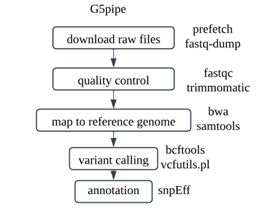
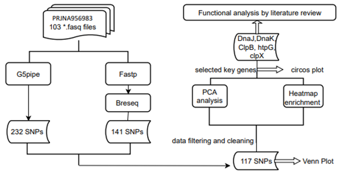

# G5pipe & Genomic variation analysis of Legionella pneumophila with heat-resistance 
The repository keeps the codes of a bioinformatic research project, tagetting to analysis genomic variations  in Legionella pneumophila with heat resistance modeled by experimental evolution, in The Chinese University of Hong Kong. In the project, an analysis tool G5pipe was developed, displaying significant capability of  finding SNPs. The project focused on anlyzing the SNPs found by both G5pipe and breseq(http://barricklab.org/breseq).
## G5pipe_structure



G5pipe has scripts for each step, which facilitates customizing workflow and debugging. 

## Preparation for run G5pipe
1. A conda environment containing trimmomatic and snpEff
2. A snpEff database constructed by yourself. A reference blog link is: https://www.cnblogs.com/JewelZ/p/17364098.html.
3. A genome.fasta and a genome.gff

## Run G5pipe without annotation
snpEff, snpEff database and genome.gff are not needed when annotation is not required.
2 name-specified directories are needed under current directory: codes and reference, which contains all shell scripts files and genome FASTA file respectively. A created directory named as SRR_number contains all structured results. 
```bash
./codes/commands_without_annotation.sh SRR_number
```


## Run G5pipe with annotation
The species name in annotation.sh should be modified to the species where sequencing data comes from. My example used Legionella pneumophila as reference genome.
2 name-specified directories are needed under current directory: codes and reference. ./codes contains all shell scripts files. ./reference contains genome.fasta and genome.gff. Results are structured in different directories 
```bash
./codes/commands.sh SRR_number
```

## Run G5pipe using our project dataset
In our project, we analyzed the genomic variation of 103 FASTQ files. The program uses a SRA name list to download all files from NCBI, and go through them with scripts in ./codes one by one. To try this example, except for the previous 2 directories, 3 files are also required: process.sh, sorted_SRArun.txt and SRAgroup.txt, which are listed in G5pipe folder in the github repo.
```bash
nohup ./process.sh &
```

## Breseq and R scripts
Breseq and some R scripts were also used to get and visualize the results of our project. The codes were listed in breseq and R_downstream_analysis. The workflow of our project is listed here for reference.


## Contact
If you have any problems with our codes, please feel free to contact: zhouyq@link.cuhk.edu.hk


